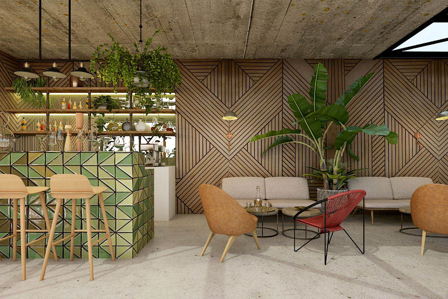
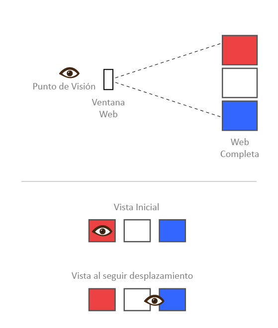
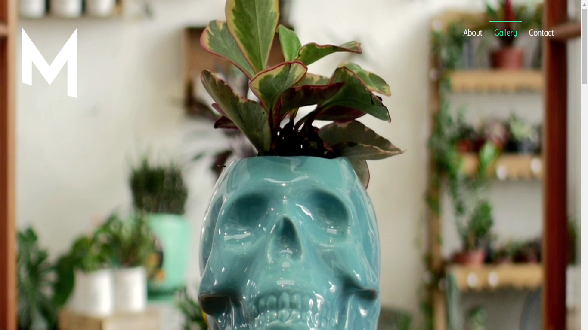
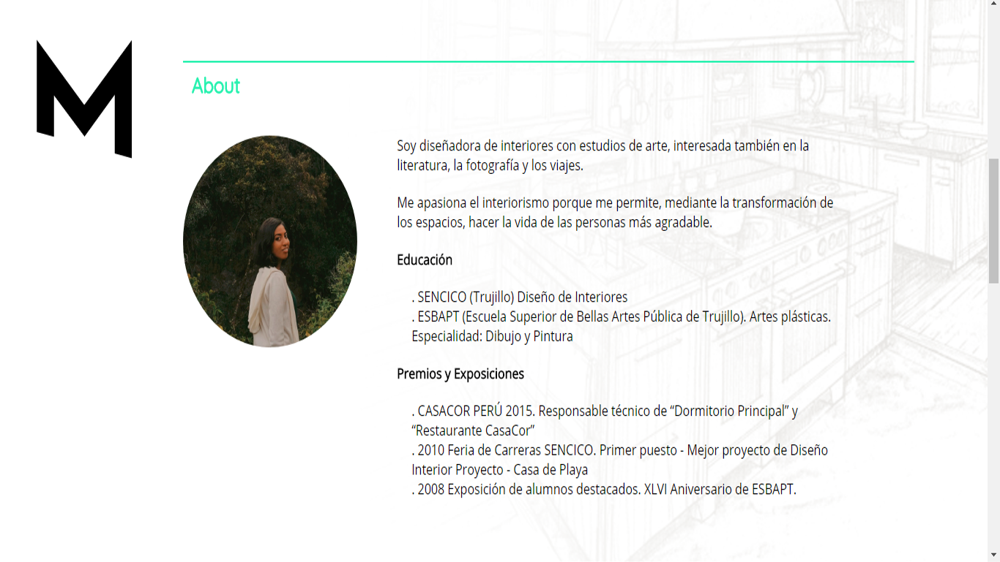
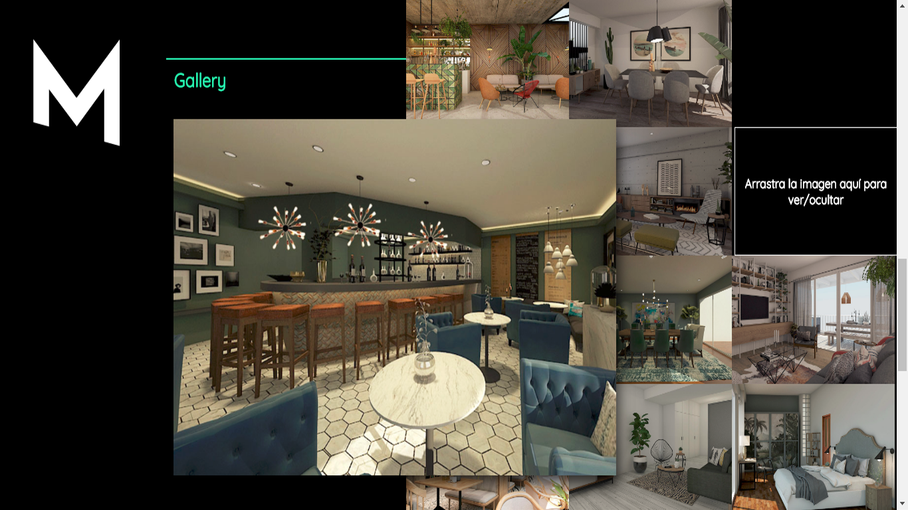
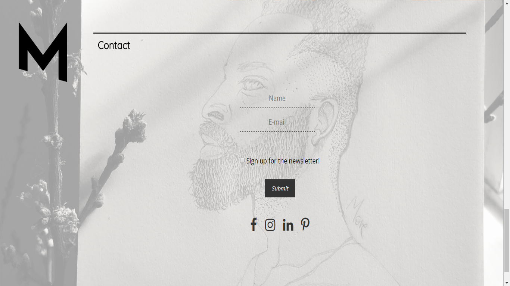

#Proyecto X.

Se le llamó “Proyecto X” ya el proyecto no contaba con nombre propio dado a la variedad de posibilidades que se presentaría como tema libre y la cantidad de posibles propuestas. Las duplas y tríos fueron designados y se nos dio un tiempo de 48 horas para realizar y presentar el trabajo.

En este caso, la dupla consistió en Nakarid Jave — quien escribe — y Michelle More, ambas egresadas de la carrera de Diseño Gráfico y actuales estudiantes de Web Developer en Laboratoria.

##More Interiorismo.

Es así como nuestro Proyecto X tuvo un nombre propio: después de discernir sobre posibles candidatos para el proyecto, decidimos tener como virtual cliente a Melissa More Flores, diseñadora de Interiores egresada de Sencico en Trujillo, que actualmente vive y labora en la ciudad de Lima.

Con esta premisa, al tener un cliente real, realizamos la web como un portafolio para que sea mostrado al mundo. El cliente nos brindó los datos necesarios, así como las imágenes que necesitábamos, todas sacadas de sus propios trabajos y de esta manera la web sea 100% funcional al terminar el proyecto: para que sea usada para ella como un portafolio real en la web y para que nuestra dupla pueda mostrar el proyecto como parte de la feria informática en donde lo mostraríamos a Laboratoria.

El primer paso de la creación de un sitio Web es determinar qué crear y cual será su uso. La página tiene que ser de fácil navegación y rápida. No excederse con elementos visuales ya que preferimos que usuario interactúe en la página y encuentre lo que busca. De esta manera posibles clientes que buscan una Diseñadora de Interiores les encuentre atractivo lo que están viendo y se contacten con nuestro cliente, el dueño de este portafolio web.

##Realización del Proyecto.

Después de definir al cliente y tener claro qué se quería mostrar, con toda la data en nuestras manos para empezar fue cuando iniciamos.
Primeramente se definió la maquetación de la web. Decidimos que sea una web tipo Scrolling (Parallax scrolling, en donde en una misma página html el usuario se desplaza hacia abajo para visualizar el contenido).

Las áreas definidas como secciones son:
- Inicio.
- About.
- Gallery.
- Contact.

De esta manera, el scrolling o desplazamiento iría en tal orden. Para ese caso se resolvió la interactividad en cada área:

1. En Inicio se presentaría la página con un video proporcionado por More Interiorismo donde se puede observar parte de su trabajo, así como mostrar dinamismo al entrar a la página.

2. En About mostraríamos el disclosure de Melissa More Flores como More Interiorismo y parte de su hoja de vida.

3. Gallery se muestra como un mosaico de imágenes que son parte del portafolio que se pueden visualizar arrastrándolas y de esta forma ampliándolas automáticamente.

4. En Contact el usuario puede escribir su nombre y correo para recibir información o recibir un newletter. Además de las redes sociales de contacto.

##Implementación.

Los requerimientos para este proyecto fue utilizar lo aprendido hasta el momento — 3er Sprint del BootCamp — y aplicar 2 eventos que vistos en clase, así como 2 nuevos eventos no vistos en clase. También se sugirió usar callbacks.

Dado esos requerimientos, los implementamos en los archivos JavaScript y Css que creamos para cada sección. Utilizamos un total de 10 eventos.

Eventos vistos en clase:
- onblur (al salir de la selección del elemento).
- onkeyup (al soltar una tecla pulsada).
- onkeypress (al pulsar una tecla — pero no soltarla).
- onmouserover /hover css(al pasar el puntero del mouse sobre cualquier elemento).
- onclick (al hacer click y soltar el mouse en cualquier elemento).

Eventos Nuevos:
- ondragstart (el evento funciona cuando se empieza a arrastrar un elemento).
- ondrag (al arrastrar un elemento).
- ondragover (funcional cuando el elemento está siendo arrastrado sobre el objeto de destino).
- ondrop (funciona cuando se suelta un elemento o una sección de texto, después de ser arrastrado, sobre un destino valido).
- onscroll (funciona como un evento de desplazamiento sobre el elemento).

Estos eventos son creados en Js e implementados en Css para darle dinamismo a la visualización.
Todo se trabajó con branches, tratando de crear un código limpio y entendible para el equipo de trabajo.

Finalmente les invitamos a visitar este proyecto en GitHub:

[https://Mishmore.github.io/More-Interiorismo/](https://Mishmore.github.io/More-Interiorismo/)

---
Proyecto X — More Interiorismo realizado por Michelle More y Nakarid Jave.
